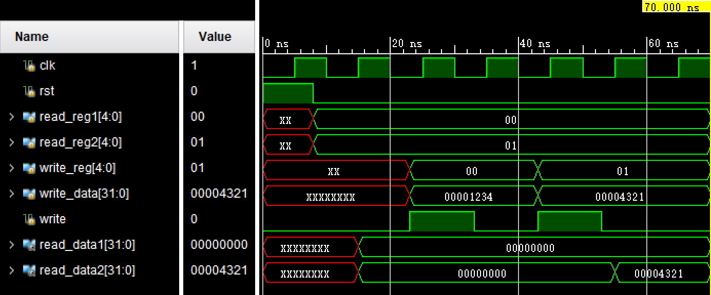
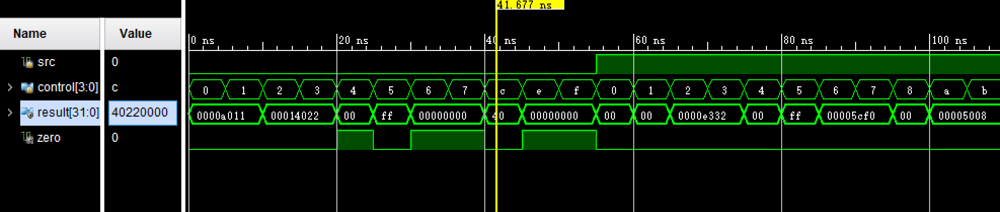

# 计算机组成原理实验报告

姓名：江川  

学号：11811712

### 实验目的

1. learn and practice on how to design the basic componet in datapath of CPU based on ISA.
2. learn and practice on how to use IP core in design.

### 实验内容

implement the registers group and alu in CPU(MIPS32)by verilog,practice on using IP cores in vivado.

1. create a registers group and verify its function by simulation
Part 1: do the design
1)the input and output ports should be same as design on page 5 of LAB9.pdf
tips: don't forger clk and Asynchronous reset.
2)the registers group should support R/I/J type instructions in MIPS32
3)there are 32 registers in this group, each register is 32bits width
4)all the registers except $0 are readable and writeable, $0 is readonly.
5)read/write the register which is identified by the address bus
Part 2: build the testbench, do the function verificatoin on following cases:
1) while Asynchronous reset is valid, all the registers is reset as zero.
2) while Asynchronous reset is invalid,regWrite is valid at the posedge of clk, write the register which is 
addressed by writeRegster with the data on writeData.(write register 0 and regiseter 1 with 32'h1234 and 32'h4321)
3) read datas from the registers which are addressed by readRegster1 and readRegster2.(read register 0 and regiseter 1)
4) others testcase in your test(optional).

2. create an ALU and verify its function by simulation
Part 1: do the design
1)the input and output ports should be same as design on page 6 of LAB9.pdf
tips: "aluSrc" (1-bit) is the input of MUX,"aluControl"(4-bits) is used to control the processing in ALU.
"data1" and "data2" is from registers group,"signExtend" is the immediat data after sign Extend.
"aluResult"(32-bits) is the output of the calculation, "zero"(1-bit) is a state flag of "aluResult".
2)implement a MUX which  should be same as design on page 6 of LAB9.pdf
tips:while "aluSrc" is zero, "data2" is selected as the output of MUX, while "aluSrc" is 1, "signExtend" is selected as the output of MUX
3)implement following calculation according to "aluControl":
0_000    logic and
0_001    logic or
0_01x    arithmatic add
0_100    logic xor
0_101     logic nor
0_11x    arithmatic sub
1_000  shift left logic "data1" with the value of bit4-bit0 in "signExtend"
1_010  shift right logic "data1" with the value of bit4-bit0 in "signExtend"
1_011  shift right arithmatic "data1" with the value of bit4-bit0 in "signExtend"
1_100  shift left logic "data1" with the value of bit4-bit0 in "data2"
1_110  shift right logic "data1" with the value of bit4-bit0 in "data2"    
1_111  shift right arithmatic "data1" with the value of bit4-bit0 in "data2"    
tips: if "aluResult" is zero,"zero" is 1,otherwise "zero" is 0;
Part 2: build the testbench, do the function verificatoin on following cases:
"data1" is 32'ha011,"data2" is 32'ha011,"signExtend" is 32'h4321 
1) "aluSrc" is 0, test all the caluctions list in 2-3)

NOTIC: while it is shift instruction test, test shift with value  of bit4-bit0 in "data2" is enough, there is no need to test shift with value  of bit4-bit0 in "signExtend"

2) "aluSrc" is 1, test all the caluctions list in 2-3)

NOTIC: while it is shift instruction test, test shift with value  of bit4-bit0 in "signExtend" is enough, there is no need to test shift with value  of bit4-bit0 in "data2"
3) others testcase in your test(optional).

### 实验步骤

使用verilog实现register和ALU

### 实验结果

