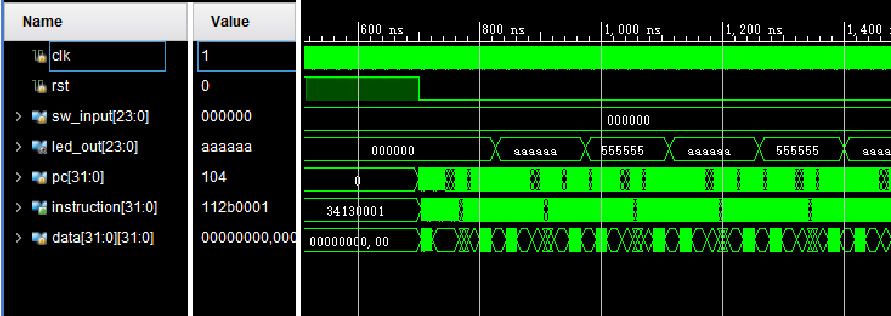

testbeach 在 sim 文件夹里。 

src.s 是 cpu 执行的指令，按照lab13课件p13写的，大意为

```c
while(true){
    $s1 = lw from io
    switch($s1[23:20]){
            ......
    }
}
```

编译出来的 coe 文件在各个模块文件夹里

**注意，本cpu的io操作实现与课件不一样，只能一次 lw/sw 32位的后24有效位**

运行效果如下

rst结束后，控制信号为x00，led交错闪烁



控制信号为001，赋值VAL，同时LED显示VAL


控制信号为010，VAL=VAL+1


控制信号为011，VAL=VAL-1


控制信号为101，VAL=VAL<<1


控制信号为110，VAL=VAL>>1，


控制信号为111，VAL=VAL>>>1，

